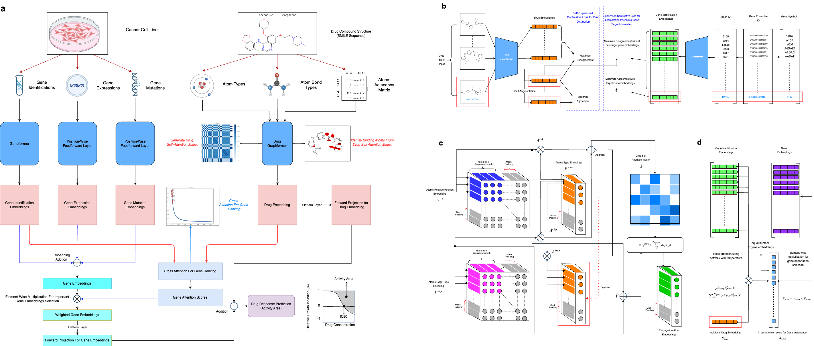

# MIDI
This is the official codebase for **MIDI: Attention-Guided Mechanism-Interpretable Drug-Gene Interaction (MIDI) Modeling for Cancer Drug Response Prediction and Target Effect Explanation**.


[](https://ai.swmed.edu/projects/midi/)

## Introduction
MIDI is an AI model trained on CCLE dataset to analyse the targeting relationship between drug molecules against genetic patterns. It can be used to predict cancer drug response, provide explaination of the molecular binding cite and detect the drug targeted genes.

MIDI is now available for a brief demo in our webserver: https://ai.swmed.edu/projects/midi/ 




a. Technology pipeline and general model architecture. 

b. Learning strategy of incorporating prior knowledge on drug-gene interaction. 

c. Detailed illustration of the self-attention GraphFormer architecture for processing drug chemical structure input. 

d. Detailed illustration for Drug-Gene cross-attention architecture design for important gene ranking and selection.

## Installation

MIDI works with Python >= 3.11.9 Please make sure you have the correct version of Python, and with anaconda and Geneformer installed

```bash
conda create -n "envtest" python=3.11.9
conda activate envtest
bash requirement.txt
```

## Tutorial
The tutorial for running MIDI is listed step-by-step in .

Our pre-trained model parameters are store in  


## Acknowledgements
